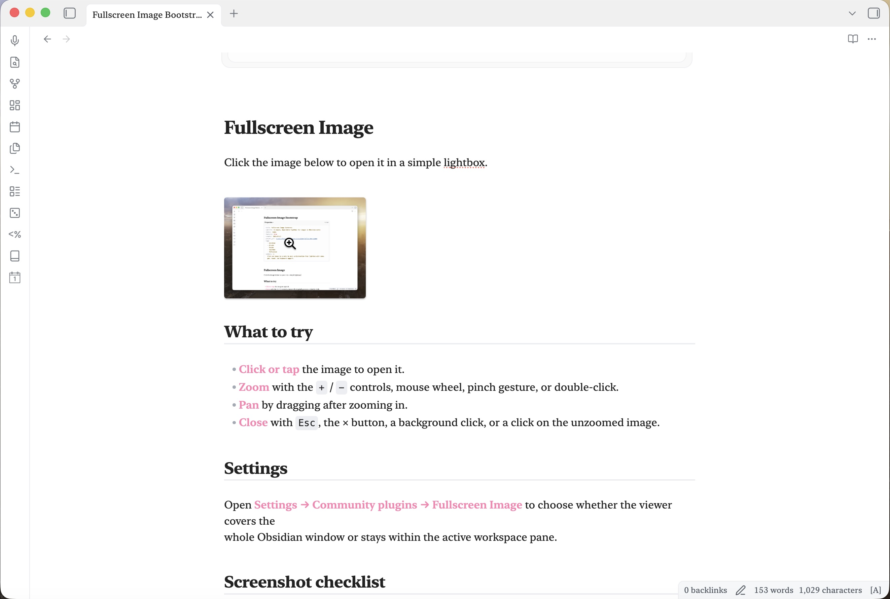
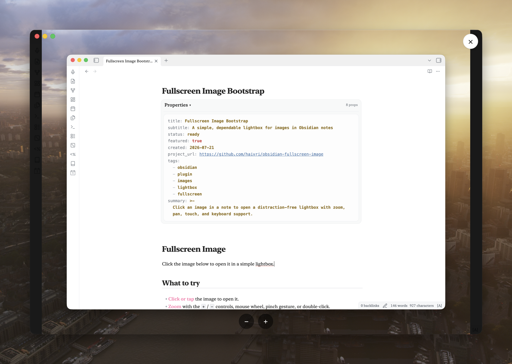
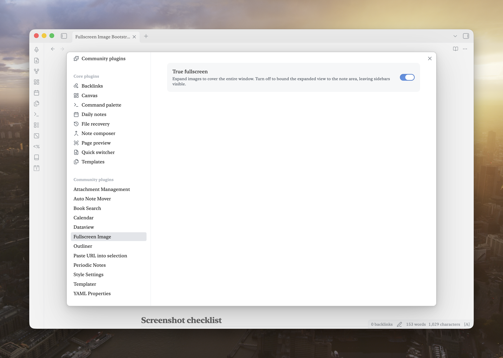

# Fullscreen Image

Click an image in a note to view it in a clean, distraction-free lightbox. Zoom with the on-screen
buttons, mouse wheel, pinch, or double-click; drag to pan when zoomed in.

Fullscreen Image is deliberately small and local-first. It does not modify your notes, collect
telemetry, or make network requests.

## Features

- Opens note images in a screen-sized lightbox or, optionally, within the active workspace pane.
- Fits every image to the available viewport without stretching it.
- Supports mouse, keyboard, touch, trackpad, and pinch-to-zoom controls.
- Keeps panning inside the image bounds so the image cannot be dragged away.
- Navigates a [Simple Gallery](https://github.com/haivri/obsidian-simple-gallery) block's images with on-screen arrows, a position counter, and the left/right arrow keys.
- Restores keyboard focus when the viewer closes.
- Works without external services on desktop and mobile.

## See it in action

### Open any note image

Images in Reading view and Live Preview show a zoom cursor. Click or tap one to open the viewer.

<p align="center">
  
</p>

### Focus on the image

The lightbox fits the image to the window, keeps the controls out of the way, and supports zooming
and panning without leaving the note.

<p align="center">
  
</p>

### Keep the choice simple

Choose whether the viewer covers the entire Obsidian window or stays inside the active workspace
pane.

<p align="center">
  
</p>

## Usage

- **Click/tap an image** — opens it in the viewer, fitting it to the available viewport regardless
  of the size it has in the note.
- **Zoom** — `+`/`−` buttons, mouse wheel, pinch (touch), or double-click/double-tap to toggle
  between fit and 2x zoom.
- **Pan** — drag once zoomed in. The viewer keeps the image within the visible area.
- **Close** — X button, Escape key, click/tap the background, or a single click/tap on the image
  while it's at its default (non-zoomed) size.

## Scope

Works for images rendered in Reading view and Live Preview, including embedded/transcluded images.
It intentionally ignores interface icons and other non-note images. Images inside iframes and
Canvas file nodes are not supported.

## Settings

- **Use the full screen** — When enabled (the default), the viewer covers the entire Obsidian
  window. Disable it to keep the viewer inside the active workspace pane.

## Installation

### Community Plugins

Once accepted, install **Fullscreen Image** from **Settings → Community plugins → Browse**.

### Manual installation

Copy `main.js`, `manifest.json`, and `styles.css` from a release into:

```text
<vault>/.obsidian/plugins/fullscreen-image/
```

Then reload Obsidian and enable **Fullscreen Image** under Community plugins.

## Development

Requires Node.js 20 or newer.

```bash
npm install
npm run dev     # esbuild watch mode
npm run build    # type-check + production build
npm run lint
```

## Release checklist

1. Run `npm run build` and `npm run lint`.
2. Test an image in both Reading view and Live Preview, with a mouse and touch input if available.
3. Run `npm version patch`, `npm version minor`, or `npm version major`. The version script keeps
   `manifest.json` and `versions.json` in sync.
4. Push the resulting numeric tag (for example `0.1.1`). GitHub Actions builds the plugin and
   attaches `main.js`, `manifest.json`, and `styles.css` to the GitHub Release.

On the maintainer workstation, use the USA OS plugin release command. It pushes the exact
`main` commit to private Forgejo and public GitHub, verifies both tips, and atomically updates
the primary vault's runtime copy while preserving its settings.

## Contributing

Bug reports and pull requests are welcome. Please keep the plugin focused: it should remain a
simple, dependable image viewer that respects local-first Obsidian workflows. Before opening a
pull request, run `npm run build` and `npm run lint`.

## Support

If Fullscreen Image improves your workflow, you can support its continued development on
[Buy Me a Coffee](https://www.buymeacoffee.com/robertfleming).

## License

MIT
